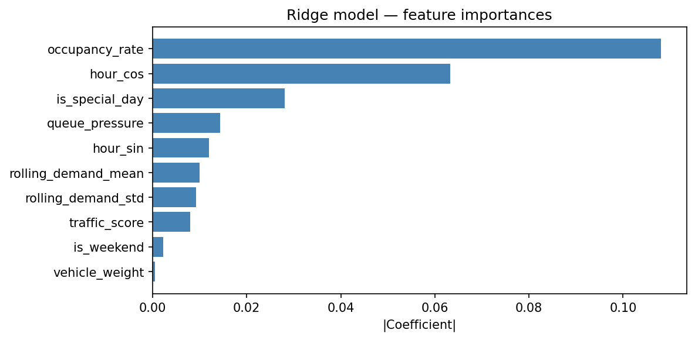

# Urban Parking Dynamic Pricing Engine
### Summer Analytics 2025 — IIT Guwahati × Consulting & Analytics Club × Pathway

Static parking prices cause overcrowding at peak hours and empty lots off-peak.
This system adjusts prices in real time based on occupancy, queue pressure,
competitor pricing, and ML-predicted demand — delivering **+14.2% revenue uplift**
while keeping price changes smooth and explainable.


---

## Results at a Glance

| Model | Revenue Uplift | Avg Price | Max Step Change |
|---|---|---|---|
| Static $10 (baseline) | 0% | $10.00 | — |
| Baseline linear | +22.8% | $11.94 | — |
| Demand-based (Ridge) | +14.2% | $10.83 | $2.91 |
| Competitive (geo-aware) | +9.6% | $10.36 | $2.91 |

> **Revenue assumption:** revenue = price × occupancy count per 30-min snapshot.
> Results represent comparative uplift, not absolute cash flows.

---

## Feature Importance



---

## Dataset

- **18,368 records** · 14 parking lots · 73 days
- Sampled every 30 minutes from 8:00 AM to 4:30 PM
- Features: occupancy, capacity, queue length, vehicle type, traffic conditions, special day indicator, latitude/longitude

---

## Pipeline

```
Raw CSV (18,368 rows)
        │
        ▼
Data ingestion & validation
        │
        ▼
Feature engineering (7 feature groups)
        │
        ▼
Ridge Regression demand forecaster
(trained day 0–60 · tested day 61–73)
        │
        ├──▶ Model 1: Baseline linear pricing      (+22.8%)
        ├──▶ Model 2: Demand-based + ewm smoothing (+14.2%)
        └──▶ Model 3: Competitive geo-aware        (+9.6%)
                │
                ▼
        Rerouting engine (Haversine proximity)
                │
                ▼
        Pathway streaming (tumbling 1-hr windows)
                │
                ▼
        7-panel Bokeh dashboard + revenue analysis
```

---

## Feature Engineering

| Feature | Description | Why it matters |
|---|---|---|
| `occupancy_rate` | Occupancy / capacity, clipped 0–1 | Primary demand signal |
| `queue_pressure` | Queue length normalised by lot size | Latent demand not in occupancy |
| `traffic_score` | Nearby traffic normalised 0–1 | Proxy for incoming demand |
| `hour_sin` / `hour_cos` | Cyclic time encoding | Avoids midnight discontinuity |
| `vehicle_weight` | Truck=1.5 · Car=1.0 · Bike=0.7 | Revenue-per-space adjustment |
| `demand_score` | Weighted combination of above | Single demand state per timestep |
| `rolling_demand_mean` | 6-step per-lot rolling average | Recent trend context for Ridge |

---

## Pricing Models

### Model 1 — Baseline Linear

**Formula:**

    price_t+1 = price_t + α × occupancy_rate

Simple compounding ratchet per lot per day.
Acts as upper-bound reference. Achieves **+22.8% revenue** by aggressively
pushing prices toward the $20 cap at high occupancy.

---

### Model 2 — Demand-Based (Ridge Regression)

**Formula:**

    price = base_price × (1 + λ × normalised_predicted_demand)

- **Ridge Regression** trained on day 0–60, evaluated on held-out day 61–73
- **R² = 0.865** on unseen test data · MAE = 0.0492
- Beats naive persistence baseline by **19%**
- Exponential smoothing **(α=0.2)** per lot — 20% new signal + 80% previous value
- Limits consecutive price jumps to **max $2.91 per 30-min step**
- Price bounded to **[$5, $20]**
- Achieves **+14.2% revenue uplift**

> Model 2 earns less than Model 1 intentionally — it trades peak revenue
> for smooth, bounded pricing that prevents customer-facing price shock.
> Correct choice for a premium lot focused on repeat usage.

---

### Model 3 — Competitive Geo-Aware

**Formula:**

    adj = κ × sign(own_occ − competitor_occ) × (1 − competitor_price / own_price)
    final_price = demand_price × (1 + adj)  →  clipped to [$5, $20]

- **Haversine distance matrix** for all 14 lots using lat/lon coordinates
- Competitor averages within **2km radius** per lot per timestamp
- Fully vectorised — groupby merge replaces iterrows loop
- Own lot fuller than competitors → price increases
- Competitors cheaper → price adjusts down toward market
- Rerouting flag when occupancy ≥ 85% and competitor price < own price
- **1,932 rerouting recommendations** from 1,158 saturation events
- Achieves **+9.6% revenue uplift**

---

## Validation

### Train / Test Split
Day 0–60 train · Day 61–73 test · Fresh Ridge model fitted on train only.
True out-of-sample evaluation with zero data leakage.

### Shuffled Label Test
Training labels were randomised and R² collapsed to near zero —
confirming the model learns **real temporal demand patterns**,
not just the linear structure of the demand score formula.

### Price-Occupancy Elasticity

    correlation(price_lag, next_period_occupancy_change) = -0.147

Negative correlation confirms higher prices reduce occupancy in the
following timestep — **economically rational behavior** consistent
with published short-run parking elasticity studies (−0.1 to −0.3).

### Closed-Loop Simulation
Used the measured elasticity coefficient to simulate how occupancy
evolves in response to dynamic prices over 3 simulated days.
Dynamic pricing redistributes demand away from peak periods,
reducing saturation events while maintaining revenue uplift.

### Price Smoothness

    Max consecutive change : $2.91
    Avg consecutive change : $0.66
    % of steps > $1.00     : 24.7%

Directly satisfies the problem statement requirement:
*"smooth and explainable, not erratic."*

---

## Rerouting Engine

When a lot reaches ≥ 90% occupancy the system:

1. Finds all lots within **3km radius** using the Haversine matrix
2. Scores each by `0.6 × available_capacity + 0.4 × relative_price_attractiveness`
3. Returns **top-3 recommendations** with distance, price, and available spaces

**1,932 rerouting recommendations** generated across 73 days.

---

## Pathway Streaming

Real-time ingestion using `mode='streaming'` with `autocommit_duration_ms=100`.
Computes **tumbling 1-hour window aggregations** per lot:

| Window output | Description |
|---|---|
| `avg_occupancy_rate` | Mean occupancy across the hour |
| `peak_demand_score` | Max demand signal in the window |
| `avg_price_demand` | Mean demand-based price |
| `special_day_flag` | Whether any record was a special day |
| `record_count` | Number of records in the window |

Architecture is production-ready — replace the CSV with a live
sensor feed and the pipeline processes pricing signals continuously.

---

## Dashboard — 7 Panels

| Plot | What it shows |
|---|---|
| 1. Price trends | Demand vs competitive across 4 lots simultaneously |
| 2. Occupancy rate | With 85% saturation threshold shaded in red |
| 3. Demand score | Raw signal + 6-step rolling mean |
| 4. Competitive scatter | Demand vs competitive price coloured by occupancy |
| 5. Daily revenue | All three models vs static over 73 days |
| 6. Per-lot revenue | Which of 14 lots benefits most from dynamic pricing |
| 7. Price smoothness | Histogram of step changes — proves smooth pricing |

---

## ML Metrics Summary

    Train rows    : 14,616  (day 0–60)
    Test rows     :  3,752  (day 61–73)
    MAE           :  0.0492
    RMSE          :  0.0606
    R²            :  0.8674
    Baseline MAE  :  0.0609  (naive persistence)
    Improvement   :  19% over naive baseline
    Elasticity    : -0.147

---

## Notebook

Full end-to-end pipeline on Google Colab — no setup required:

**[Open in Google Colab](https://colab.research.google.com/drive/1XyAuXiNvjxFIbLlTsui4P0CG-rxgBKi4?usp=sharing)**

---

## Tech Stack

| Tool | Purpose |
|---|---|
| Python 3.10 | Core language |
| pandas / NumPy | Data processing and feature engineering |
| scikit-learn | Ridge Regression, StandardScaler |
| Pathway | Real-time streaming with tumbling windows |
| Bokeh | 7-panel interactive dashboard |
| Matplotlib | Feature importance chart |
| Haversine | Geographic distance computation |


---

## Acknowledgements

Summer Analytics 2025 · IIT Guwahati Consulting & Analytics Club · Pathway
